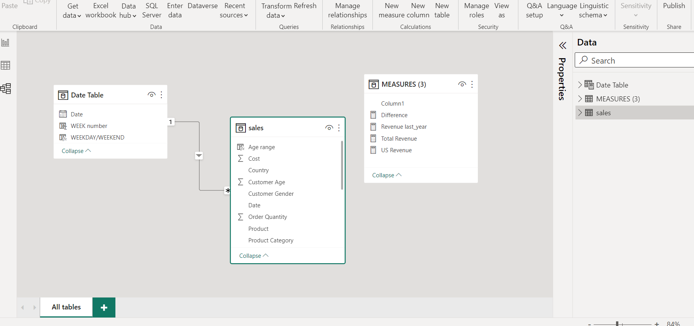
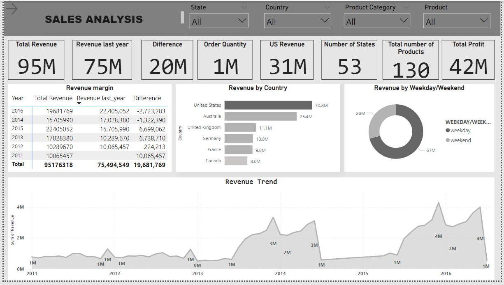

# Sales-Performance-Analysis

This is a Power BI project that is focused on how the sales of different items affects Revenue, Profits across different countries. 
We had the Product Category, Sub-category e.t.c

_Disclaimer_ This project is not a real life project. It was done to show the capabilities of Power BI and DAX. This is a dummy Dataset that was downloaded from kaggle Datasets.Therefore, all informations therein are imaginary.

**Data Description**

The Dataset consists of 113036 rows and 15 Columns respectively.

**Skills Demostrated**

1. Data Cleaning
2. DAX
3. Page Navigation
4. Filters
5. New Measures

**Modelling**: The Dataset consists of  only a table. The Modeling that was done here was to create a Date table. I wanted my date column to be on a table so i could create several measures using the Date table. After creating the Date table, i modelled it together with the existing Sales table. Below is an image of what it looks like.

**Problems Statement**

1. This Analysis was carried out in order to know the country which recorded the highest Revenue, and to know the days when sales are at their peak.
2. The Analysis was carried out to also confirm the products that has more sales in each of its category.

**Visualization** : The visualization consists of 3 Pages
- Overview Page
- Revenue by Category,Product
- Profit, Age range, Sub-category

**Data Transformation Process**

1. The first manipulation that was done here, was to group my Customers Ages into different Age brackets. A DAX measure was written for this.

    Age range = IF(sales[Customer Age]>=17&&sales[Customer Age]<=25,"under age",IF(sales[Customer Age]>=26&&sales[Customer Age]<=35,"middle age",IF(sales[Customer       Age]>=36&&sales[Customer Age]<=45,"young adult",IF(sales[Customer Age]>=46&&sales[Customer Age]<=55,"senior age",IF(sales[Customer Age]>=56&&sales[Customer Age]     <=69,"mature age","old age")))))

2. The next transformation that was done was to immediately calculate the total Revenue made. A DAX meaure was written for this to be done.

    Total Revenue = sum(sales[Revenue])

3. Weekend/Weekday Sales was analyzed to check the peiods that high sales were recorded.

    WEEKDAY/WEEKEND = IF('Date Table'[WEEK number] =6 || 'Date Table'[WEEK number] = 7, "weekend","weekday")

**Sales Analysis**

The store has a total of 130 Products, 17 Sub-category and 3 Products category. 

The Sales cut accross 53 States in total, and recorded about **95M** Total Revenue with United States which has the highest sales and highest Revenue

In Dec 2015 the highest sales was generated.

Below is an image showing the Overview page of the Transactions that was carried out in the Sales Analysis.

Another image below shows how Revenue affects all other metrics.We can see in the map visual that there is high concentration of the bubbles in the North America region.

